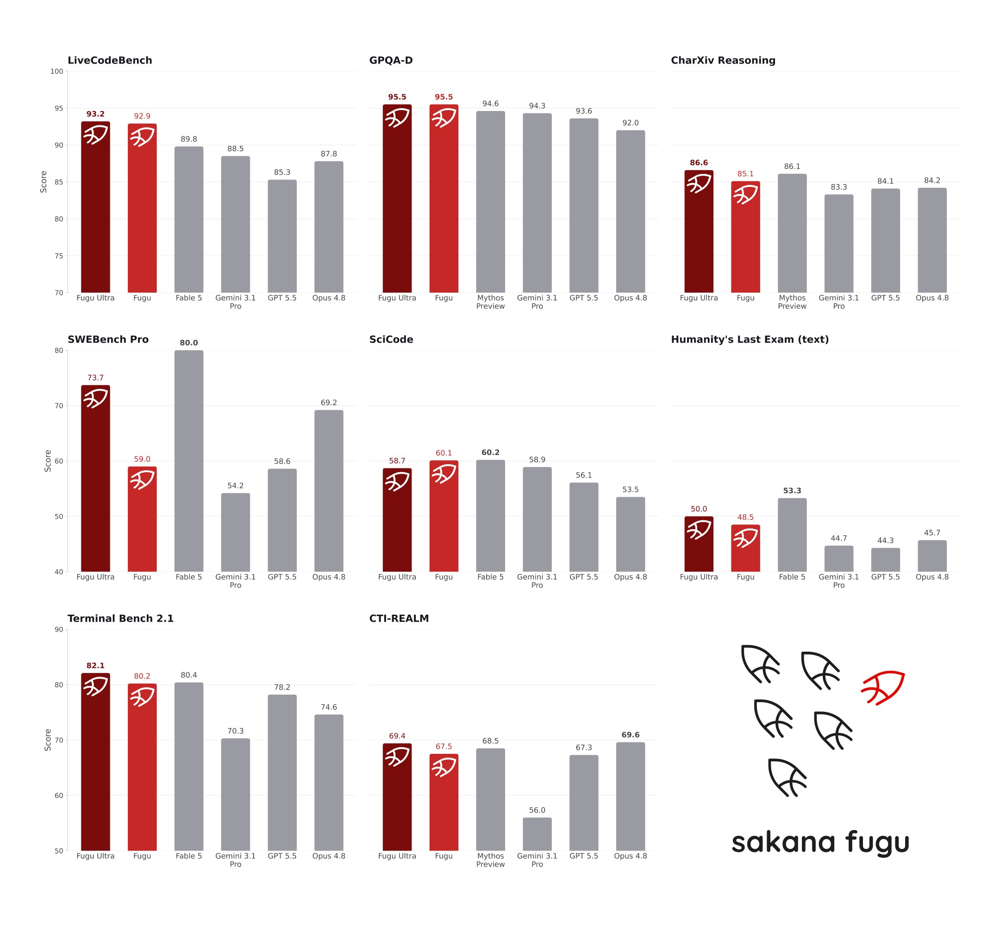
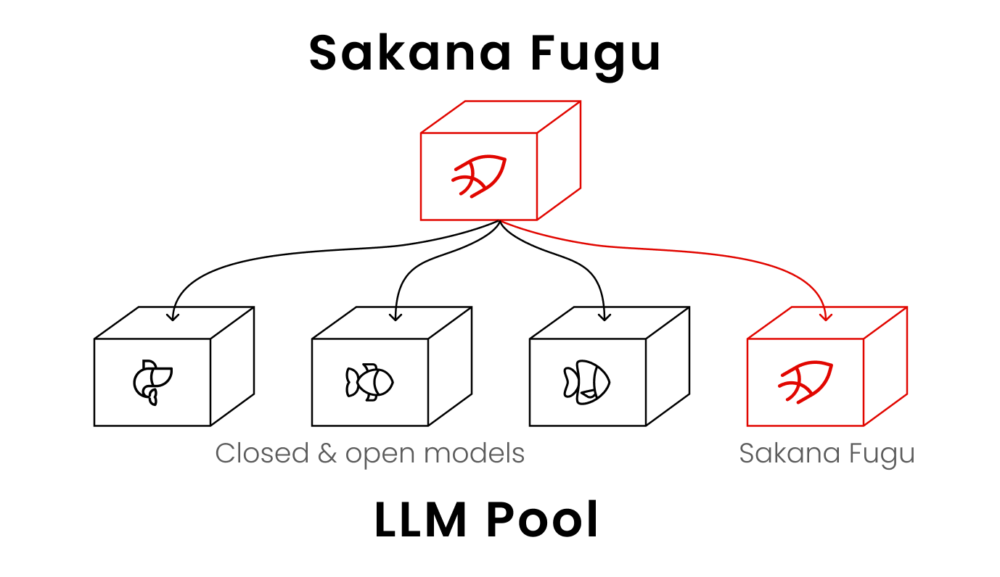

# Sakana Fugu 🐡 — Multi-Agent AI Orchestration System

**Sakana Fugu** is a revolutionary multi-agent orchestration system that combines the computational power of the world's best language models under the hood of a single, seamless interface. Fugu takes on all the complexity of routing, role distribution, and response verification, providing the user with ultimate generation quality without the need to manually configure complex agent chains.

<div align="center">
  <a href="../../releases">
    
  </a>
</div>

---

## Why choose Sakana Fugu?

In the era of AI market fragmentation, Sakana Fugu offers a fundamentally new approach — **collective intelligence**. Here are the key advantages that make Fugu superior to traditional single LLMs:

1. **Overcoming Geo- and Export Restrictions (AI Sovereignty):** If access to a specific advanced model is restricted due to regulatory or vendor limitations, Fugu automatically compensates for this. It aggregates the power of available alternative models (e.g., a pool of Gemini, Claude, and local models), delivering a combined quality that surpasses the blocked counterparts.
2. **Flexible Compliance Management (Data Protection):** Unlike closed systems, Fugu allows you to manually configure the agent pool. If your company's security policy prohibits sending data to a specific AI provider, you can exclude it in one click. The system will instantly rebuild the orchestration logic without losing quality.
3. **Recursive Self-Correction:** The coordinator model can call itself to critically analyze intermediate results. If the verifier agent finds an error in the code or text, Fugu sends the task for another iteration until the result is perfect.
4. **Maximum Resource Savings:** You no longer need to pay for dozens of separate subscriptions for different employees. A single API or Fugu desktop client centralizes access to the entire ecosystem of top neural networks.
5. **Unprecedented Accuracy on Complex Benchmarks:** On multi-step reasoning tasks, security audits, and mathematical analysis, Fugu outperforms direct calls to giants like GPT-5.5 and Claude Opus 4.8 through model synergy.

---

## Installation

The Sakana Fugu desktop application provides a convenient graphical interface for managing orchestration, customizing model pools, and monitoring agents in real time.

### Method 1: Windows (`.exe`)

1. Go to the [**Releases**](../../releases) section on this repository's page.
2. Download the latest version of the installer: `Sakana-Fugu-x64.7z`.
3. Run the file and follow the installation wizard instructions.
4. Once completed, launch the application from your desktop.

### Method 2: macOS (`.dmg`)

1. Go to the [**Releases**](../../releases) section and download the version for your architecture:
* `Sakana-Fugu-macOS.dmg` (for Apple M processors)


2. Open the downloaded `.dmg` file and drag the **Sakana Fugu** icon into the **Applications** folder.
3. On first launch in macOS Sequoia or newer, you may need to confirm permission in *System Settings > Privacy & Security*.

> **IMPORTANT NOTE:** In honor of the desktop client launch, a special trial period is active. Full access to orchestration and all model capabilities is provided **absolutely free of charge until July 11, 2026 (11.07.2026)**. To activate, simply download the client and log in with your account.

---
## How does it work?



**Sakana Fugu** is itself an LLM, trained to call various LLMs in an agent pool, including instances of itself recursively. **Fugu** dynamically orchestrates the world's best models to tackle complex, multi-step tasks.

As shown in this figure, **Fugu** is a multi-agent system that behaves like a single model. You send a request to one endpoint, and **Fugu** decides how to handle it internally.

**Fugu** manages model selection, delegation, verification, and synthesis automatically. It solves tasks directly when that is enough, or coordinates a team of expert models when a problem calls for more. The complexity of a multi-agent system never reaches your code.

## Orchestration Architecture: How does it work?

At the core of Sakana Fugu lies a concept that entirely replaces manual prompt engineering with intelligent task distribution. Instead of sending your request to a single neural network, Fugu initiates an internal control loop.

```text
                   [ Your Request (Prompt) ]
                              │
                              ▼
               ┌─────────────────────────────┐
               │ Coordinator Model (7B)      │
               └──────────────┬──────────────┘
                              │ (Analysis and decomposition)
                              ▼
         ┌────────────────────┼────────────────────┐
         │                    │                    │
         ▼                    ▼                    ▼
┌─────────────────┐  ┌─────────────────┐  ┌─────────────────┐
│  Role: Thinker  │  │  Role: Worker   │  │  Role: Verifier │
│     (Plan)      │  │     (Code)      │  │      (Eval)     │
└────────┬────────┘  └────────┬────────┘  └────────┬────────┘
         │                    │                    │
         └────────────────────┼────────────────────┘
                              │ (Recursive verification)
                              ▼
               ┌─────────────────────────────┐
               │  Merging and final response │
               └─────────────────────────────┘

```

1. **Request Decomposition:** A specialized lightweight and fast coordinator model (~7B parameters) takes your prompt and breaks it down into subtasks. The architecture is based on advanced research papers *Trinity* and *Conductor* (presented at ICLR 2026).
2. **Dynamic Role Assignment:**
* **Thinker:** A model with a deep logical window (e.g., reasoning architectures) builds a step-by-step solution plan.
* **Worker:** Models strong in applied tasks (coding, creative text) execute the plan's points.
* **Verifier:** Strict critical models validate the result for syntax errors, hallucinations, and compliance with the requirements.


3. **Context Merging:** The agents' results are gathered together, cleared of redundancy, and delivered to the user as a single structured response via an OpenAI-compatible endpoint.

---

## 🛠️ Complete Feature Overview (End-to-End)

The Sakana Fugu desktop application and API provide a comprehensive set of tools for your workflow:

### 1. Unified Intelligent Chat Interface

* **Input of Any Complexity:** From simple questions to uploading massive arrays of documentation.
* **Streaming:** You see not just the answer, but the logical steps (the coordinator's "thoughts"), displaying exactly which model is currently executing a subtask.

### 2. Model Pool Manager

* **Vendor Toggle:** Checkboxes to activate models from OpenAI, Anthropic, Google, Mistral, as well as locally deployed weights (via Ollama/vLLM).
* **Priorities and Weights:** The ability to specify which models to use for priority tasks to optimize speed or budget.

### 3. Developer Tools (Advanced Coding Suite)

* **Code Security Audit:** Automatic detection of vulnerabilities (SQL injections, memory leaks) powered by the verifier agent.
* **Cross-Language Refactoring:** Migrating a codebase from one programming language to another with automatic unit test writing by parallel agents.

### 4. Ultra-Large Context Management

* The standard Fugu version optimizes the context for fast performance.
* The **Fugu Ultra** version supports a context window of **up to 272K tokens**, allowing the upload of entire repositories or patent books for end-to-end analysis.

### 5. Session Logging and Export

* Detailed dump of the Reasoning Tree in JSON format for subsequent analysis by developers.
* Export dialogs and generated artifacts to Markdown, PDF, and HTML.

---

## Pricing and Subscription Plans

After the free trial period ends (from 12.07.2026), system usage will be billed according to the following schemes:

### 1. API (Pay-as-you-go)

You pay a fixed, transparent cost for tokens, regardless of how many models within the pool were used to solve the task:

* **Fugu (Standard):** $1.50 per 1M input tokens / $6.00 per 1M output tokens.
* **Fugu Ultra (Context up to 272K):** $5.00 per 1M input tokens / $30.00 per 1M output tokens (for context volumes exceeding 272K tokens, the rate doubles).

### 2. User Subscriptions (Desktop and Web)

Designed for individual professionals and teams:

* **Standard ($20 / month):** Basic orchestration limits, standard context window, access to all major providers.
* **Pro ($100 / month):** 10 times more high-complexity requests available, priority access to the Fugu Ultra coordinator.
* **Max ($200 / month):** 20 times the limits compared to Standard, dedicated compute nodes for the coordinator, extended large file support.

---

## 📄 License

Sakana Fugu software is distributed under the **MIT** license. For detailed information, see the [LICENSE](LICENSE) file attached to this repository.

---

*Proudly developed by Sakana AI. Tokyo, 2026.*
